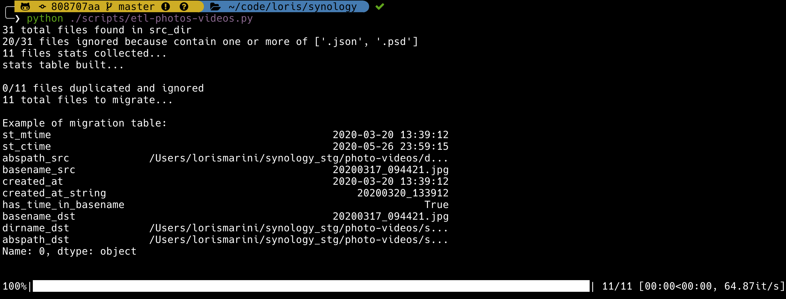
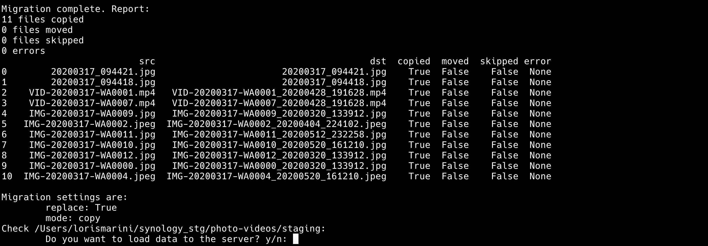
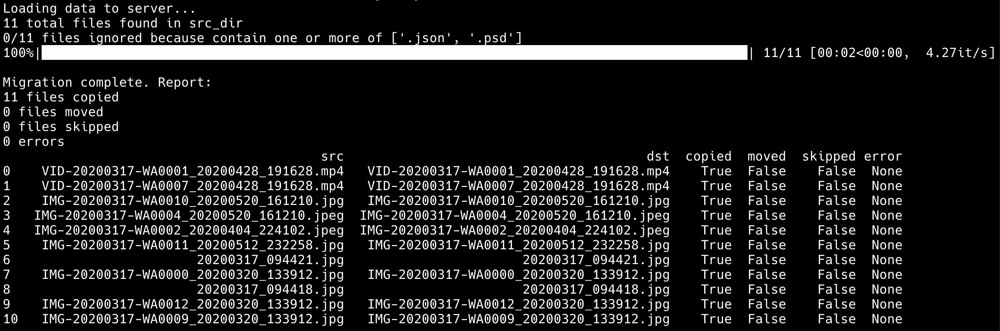

From an arbitrarily-nested directories and files, the script should:

1. **list** recursively inside `dump`
1. determine the **creation time** of each file
1. **ignore** files containing specific patterns (e.g. '.json' or '.psd')
1. **fuzzy-search** time information in the file name
1. **add timestamp** `_YYYY-MM-DD_H-M-S` to files that need it
1. deduplicate files (by basename and creation time)
1. organise files in folders named after the date of creation `YYYY-MM-DD`.
1. upload this new structure to my Synology volume

**Features**
1. Graceful handling of errors and unexpected situations
1. Stage the new file structure in `staging` before transferring files to the server (relatively slow)
1. Audit each migration plan to see what, why, and how it happened.

**Example of tree**

```zsh
    ├── dump
    │   ├── test_upload.json
    │   ├── VID_20190513_211732488.mp4
    │   ├── business_id_test.jsonl
    │   ├── dir
    │   |   └── IMG_5712-2.jpg
    │   ├── dir2
    │       └── dir3
    │           └── wedding_primo_ballo.mp4
    └── staging
        ├── 2015-10-04
        │   └── IMG_5712-2_20151004_013542.jpg
        ├── 2019-08-28
        │   └── wedding_primo_ballo_20190828_072354.mp4
        └── 2019-09-07
            └── VID_20190513_211732488.mp4
```

**Parameters**

The script behaviour can be changed with 2 attributes:

- `replace`: if True files with the same name are overritten
- `mode`: one of ['copy', 'move']. Choose 'copy' for idempotency.

Modify this part of the script accordingly:

```python
dir_dump: str = '/Users/lorismarini/synology_stg/photo-videos/dump'
staging_dirs: str = '/Users/lorismarini/synology_stg/photo-videos/staging'
dir_server = '/Volumes/photo'
replace: bool = True
mode: str = 'copy'
```

**Screenshots**
First invocation:


The script returns a report with details of each migration from `dump` to `staging`


When the files in `staging` are ready we should check that everything looks right. The last step is to load data to the server:


**Quick Improvements**

There are a number of easy fixes here:

1. The script does not distinguish between photos and videos. Should it separate the two? Maybe.
1. The function `has_time_info` assumes that "-" is used to separate datetime parts, while "\_" is used as a separator. The result is that the filename `FILE_20200101.jpg` is considered not to have time info.
1. I assume the creation time is the minimum between [ctime and mtime](https://www.gnu.org/software/coreutils/manual/html_node/File-timestamps.html), which is a big assumption. Next I might look at ways to read the creation time from the file metadata (with projects like [exif](https://pypi.org/project/exif/))
1. Ad warning when mode="copy" and the `dump` folder is over 5GB in size, and wait for user input to proceed.
1. Add tests
