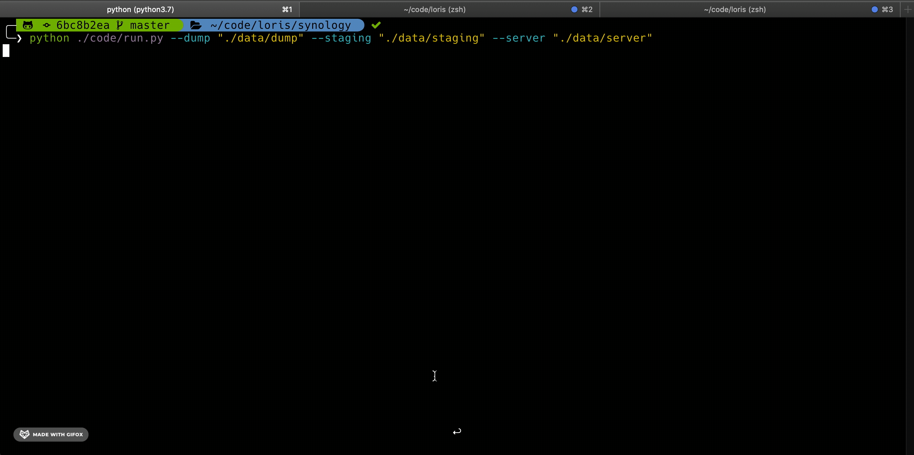

### Problem

I generate four types of content (documents, photos, videos, audio) from many devices. Periodically, I need to organise the data in my laptop, renaming, deduplicating, and copying files around, before loading them to my NAS. The process is tedious, irreproducible, and error prone.

## Solution

A tool that reads from a "dump" folder and automatically sorts content to various drives on my home server:

1. read data from a `dump` folder
1. run a script
1. find content organised by date/type on my server

### Demo

Here we read from `./data/dump` which contains some sample files. A migration plan is prepared and executed (copy + rename) to separate images, videos, audio, and archives in corresponding subdirectories under `./data/server`.

Output tree:

```zsh
├── data
│   ├── server
│   │   ├── audio
│   │   ├── documents
│   │   │   └── 2020-05-28
│   │   │       ├── file-sample_100kB_20200528_075418.doc
│   │   │       ├── file-sample_100kB_20200528_075421.docx
│   │   │       ├── file_example_PPT_250kB_20200528_075527.ppt
│   │   │       ├── file_example_XLSX_10_20200528_075440.xlsx
│   │   │       └── file_example_XLS_10_20200528_075315.xls
│   │   ├── photo
│   │   │   └── 2020-05-28
│   │   │       ├── file_example_GIF_500kB_20200528_080038.gif
│   │   │       ├── file_example_JPG_100kB_20200528_075950.jpg
│   │   │       ├── file_example_MP3_700KB_20200528_074935.mp3
│   │   │       ├── file_example_OOG_1MG_20200528_075651.ogg
│   │   │       └── file_example_PNG_500kB_20200528_080012.png
│   │   └── video
│   │       └── 2020-05-28
│   │           ├── file_example_MP4_480_1_5MG_20200528_074720.mp4
│   │           └── file_example_WAV_1MG_20200528_074955.wav
```

CLI script

```zsh
python ./code/run.py --dump "./data/dump" --staging "./data/staging" --server "./data/server"
```



Reports


### Details

From an arbitrarily-nested directories and file types, I want to:

1. **list** all files recursively
1. **timestamp** files based on creation time `_YYYY-MM-DD_H-M-S`
1. **fuzzy-search** time information in the file name
1. **deduplicate** files (filename + extension + creation time)
1. **organise** files in tree based on file type and creation date `YYYY-MM-DD`
1. **load** the new structure to my server
1. **handle** errors gracefully
1. **stage** files before loading to the final destination (optional)
1. **audit** data migration plans
1. provide **building blocks** to perform arbitrary migrations (including those within the NAS itself)

A migration is made of two function calls:

`plan()`

Implements a migration plan and includes these steps:

1. Discover all files in `dump`
1. Build a table to describe them (name, extension, time, size, type)
1. Extend the table with information of where they should be moved to (migration table)

`execute()`

Takes the original absolute path of each file (abspath_src) and their new absolute path at the destination (abspath_dst). Each file is then moved/copied, replacing/skipping depending on the global settings:

- `replace`: if True files with the same name are replaced
- `mode`: one of ['copy', 'move']. Choose 'copy' for idempotency.

### File Types

File types are inferred form their extension (or suffix). I considered using [filetype](https://github.com/h2non/filetype.py) but it's expensive when the `dump` directory is over the network, so I decided to assume that the file suffix reflects the true file type. Extensions are mapped by the `extensions_and_types()` function which maps **file_types** ("image", "video", "audio", "archive") to **file_extensions**.

### Other scripts

The code is modular and it's possible to perform custom migrations by altering the way plans are built. Inside `jobs` there are two simple scripts that demonstrate this.


### Mounting a remote storage on macOS

1. locate the internal (LAN) IP address <my.ip.addr.ess> of yor server (e.g. 192.168.1.110)
2. From finder `cmd + K` and type `afp://<my.ip.addr.ess>`. Replace *afp* with *smb* to user Samba3.
3. Authenticate with userbame and pw and you should see the volume mounted
4. For me thse are under:
    - /Volums/photo
    - /Volums/video
    - /Volums/photo
    - /Volums/documents

### Improvements

1. The function `has_time_info` assumes that "-" is used to separate datetime parts, while "\_" is used as a separator (for example `FILE_20200101.jpg` is considered not to have time info).
1. I assume the creation time is the minimum between [ctime and mtime](https://www.gnu.org/software/coreutils/manual/html_node/File-timestamps.html). Next I might look at ways to read the creation time from the file metadata (with projects like [exif](https://pypi.org/project/exif/))
1. Warning when mode="copy", `dump` is over 5GB in size, and we are using a `staging` plan
1. Add tests

Constructive feedback is welcome, open an issue or submit a PR :D.
