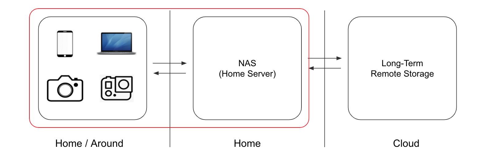

## What

A tool to organise my digital life from a dump folder to various drives on my home server (WIP).

### Problem

A zoo of devices generates content of different types, sizes, and naming and conventions that sit on various storage devices.



To bring these to life, I built a home server. I would like:

1. dump all content in one folder
1. run a script
1. find all content neatly arranged on my server

**Must Haves**

From an arbitrarily-nested directories and file types, I want to:

1. **list** all files recursively
1. **timestamp** files based on creation time `_YYYY-MM-DD_H-M-S`
1. **fuzzy-search** time information in the file name
1. **deduplicate** files (filename + extension + creation time)
1. **organise** files in tree based on file type and creation date `YYYY-MM-DD`
1. **load** the new structure to my server
1. **handle** errors gracefully
1. **stage** files before loading to the final destination (optional)
1. **audit** data migration plans.

### Solution

Clone the repo, cd into it, and run:

`python run.py`

###How

A migration is made of two function calls:
- plan()
- execute()

`plan()` implements a migration plan and includes these steps:

1. Discover all files in dump
1. Build a table to describe them (name, extension, time, size, type)
1. Extend the table with information of where they should be moved to (migration table)

`execute()` takes the original absolute path of each file (abspath_src) and their new absolute path at the destination (abspath_dst). Each file is then moved/copied, replacing/skipping depending on the global settings.

The default behaviour is to read from `./data/dump` which contains some sample files. A migration plan is prepared and executed (copy + rename) to separate images, videos, audio, and archives in corresponding subdirectories under `./data/staging`. Following the prompts you can the migrate over to `./data/server.`

**Example of tree**

```zsh
    ├── dump
    │   ├── test_upload.json
    │   ├── VID_20190513_211732488.mp4
    │   ├── business_id_test.jsonl
    │   ├── dir
    │   |   └── IMG_5712-2.jpg
    │   ├── dir2
    │       └── dir3
    │           └── wedding_primo_ballo.mp4
    └── staging
        ├── 2015-10-04
        │   └── IMG_5712-2_20151004_013542.jpg
        ├── 2019-08-28
        │   └── wedding_primo_ballo_20190828_072354.mp4
        └── 2019-09-07
            └── VID_20190513_211732488.mp4
```
